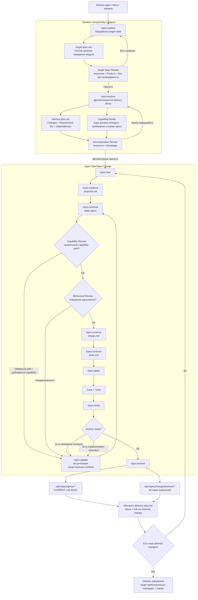
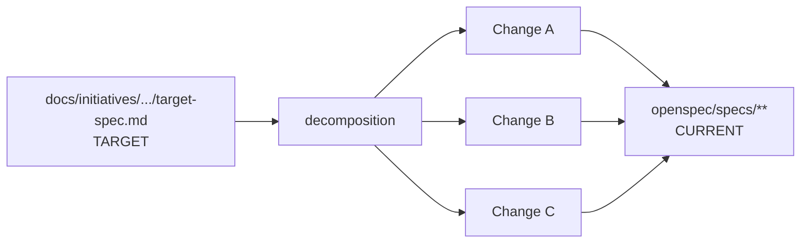
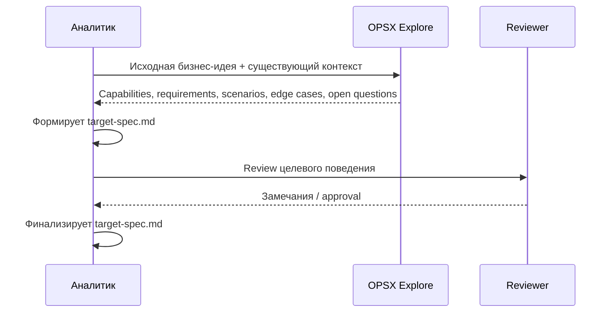
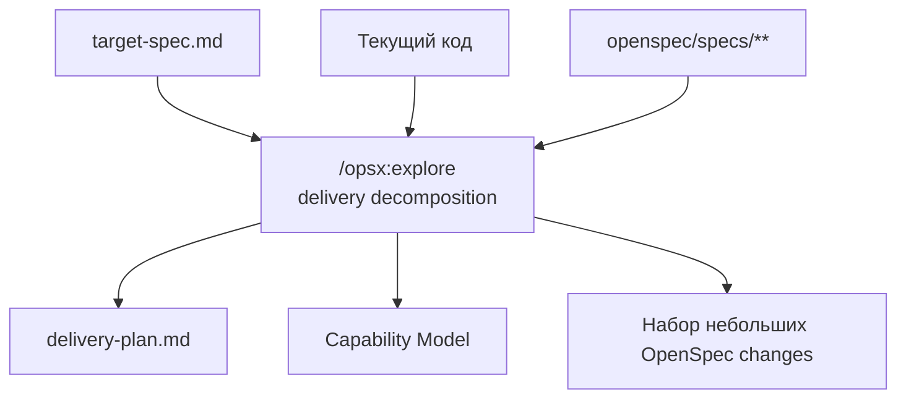
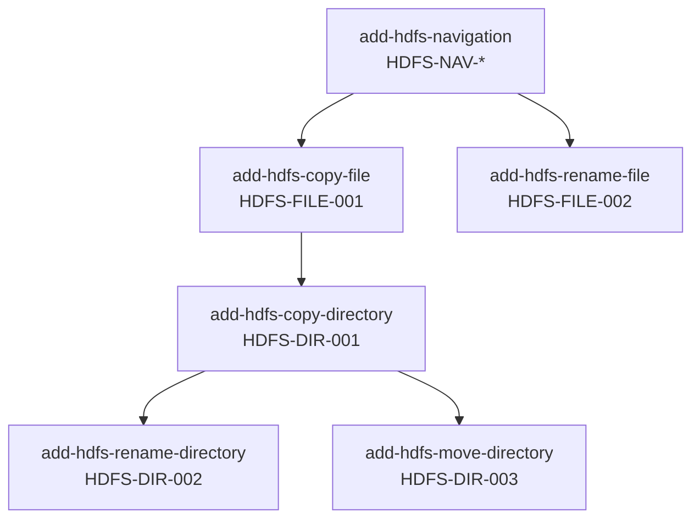
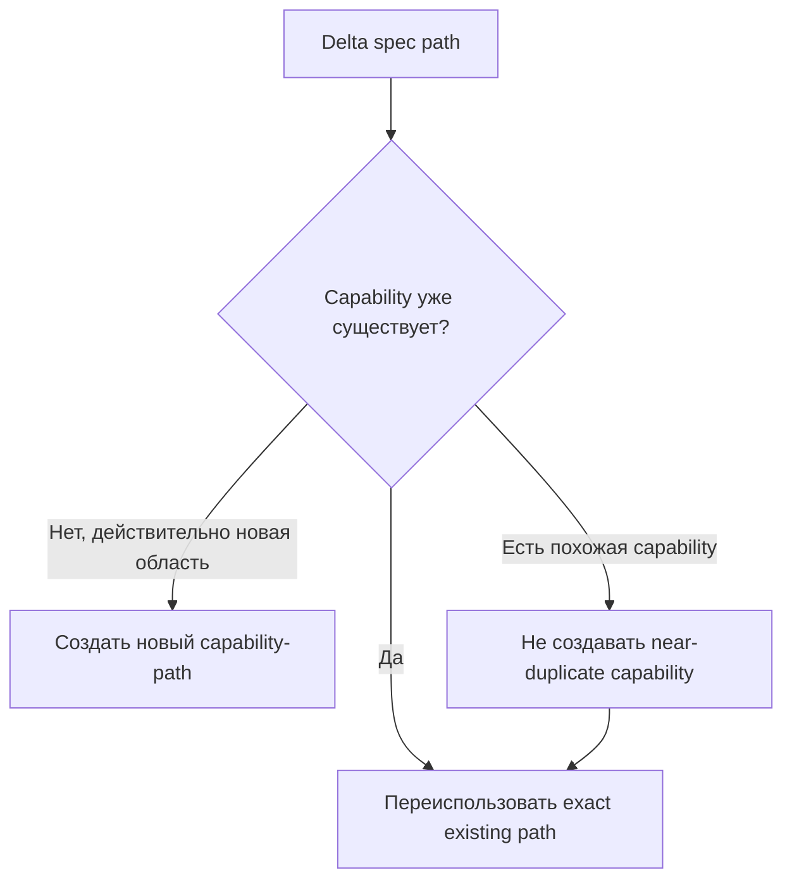
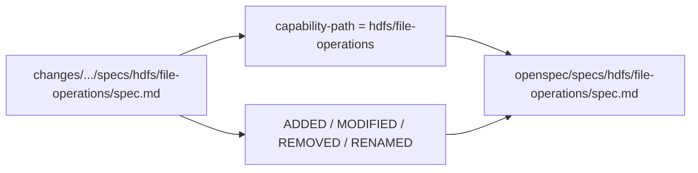
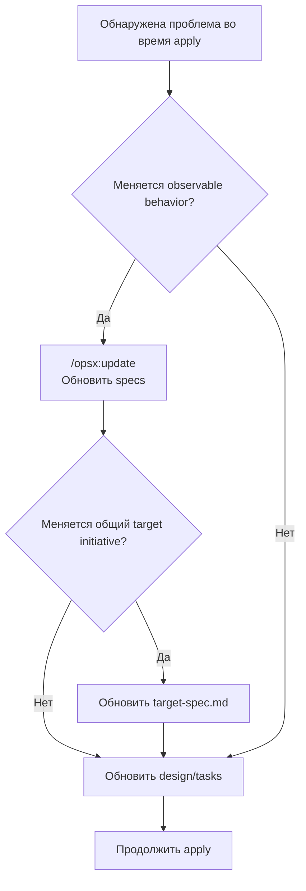
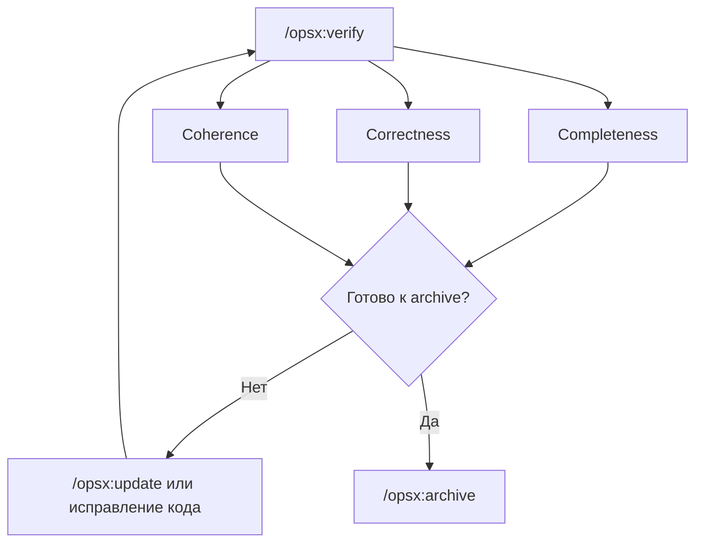
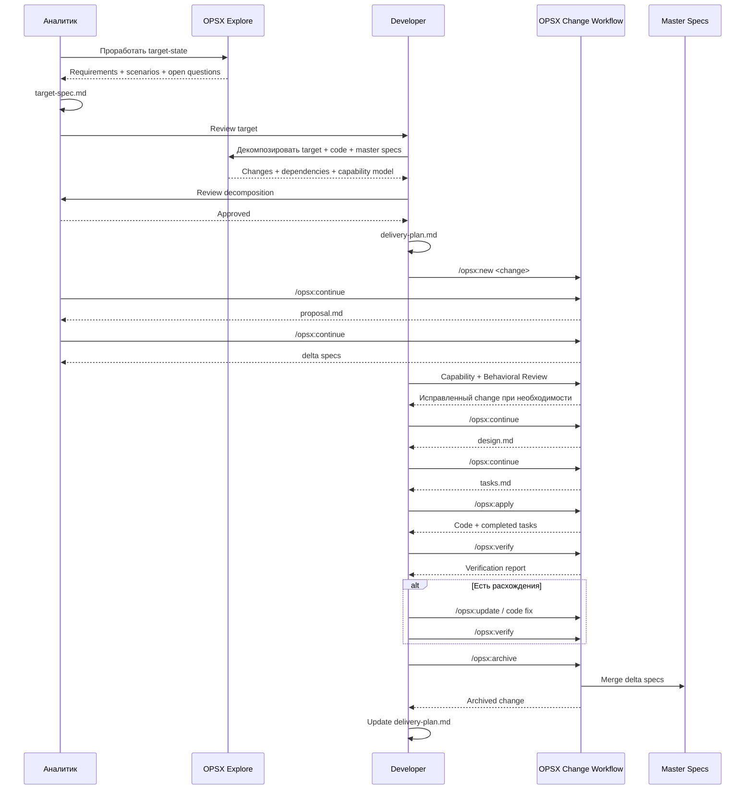

# Полная карта flow OpenSpec / OPSX для SDD

> Версия для командного обсуждения.  
> Цель: показать полный путь от большой продуктовой идеи до инкрементальной реализации, архивирования change и обновления master specs.

---

## 0. Термины

В этом документе используются четыре уровня:

| Уровень | Что это | Где хранится |
|---|---|---|
| **Initiative / Module Target Spec** | Полное целевое поведение модуля | `docs/initiatives/active/<module>/target-spec.md` |
| **Delivery Plan** | Декомпозиция target-state на поставляемые OpenSpec changes | `docs/initiatives/active/<module>/delivery-plan.md` |
| **OpenSpec Change** | Один независимо поставляемый increment | `openspec/changes/<change>/` |
| **Master Specs** | Текущее реализованное поведение системы | `openspec/specs/**/spec.md` |

Главный принцип:

```text
Target Spec   = куда хотим прийти
Delivery Plan = как будем туда идти
OpenSpec Change = что поставляем сейчас
Master Specs  = что уже действительно поставлено
```

---

# 1. End-to-end карта



---

# 2. Главный lifecycle одного change


В целевом командном процессе рекомендуется **не использовать `/opsx:propose` как основной stage-gated workflow**, потому что `propose` создаёт весь planning-пакет сразу.

Используем:

```text
/opsx:new
/opsx:continue   # proposal
/opsx:continue   # specs
REVIEW
/opsx:continue   # design
/opsx:continue   # tasks
/opsx:apply
/opsx:verify
/opsx:archive
```

---

# 3. Где находится глобальная спецификация

Глобальная функциональная спека модуля не является master spec.



Пример:

```text
docs/
└── initiatives/
    ├── active/
    │   └── hdfs/
    │       ├── target-spec.md
    │       └── delivery-plan.md
    └── archive/
```

---

# 4. Формирование target-spec аналитиком



`target-spec.md` описывает **полный целевой результат**, даже если он будет реализован за несколько итераций.

Рекомендуется использовать стабильные Requirement IDs:

```text
HDFS-NAV-001
HDFS-NAV-002
HDFS-FILE-001
HDFS-FILE-002
HDFS-DIR-001
```

---

# 5. Декомпозиция target-spec



Критерии хорошего change:

- даёт законченное observable behavior;
- может быть реализован и протестирован отдельно;
- может быть отдельно archived;
- не требует ждать завершения всей initiative;
- достаточно мал для одной итерации;
- явно знает, какие Requirement IDs из target-spec он реализует.

---

# 6. Пример HDFS-декомпозиции

Исходный target:

```text
HDFS
├── Navigation
├── Copy file
├── Rename file
├── Copy directory
├── Rename directory
└── Move directory
```

Capability model:

```text
hdfs/
├── navigation
├── file-operations
└── directory-operations
```

Delivery plan:



---

# 7. Capability mapping — ключ к master specs

Имя change **не определяет**, какой master spec будет изменён.

```text
change name:
add-hdfs-copy-file
```

не означает автоматически:

```text
openspec/specs/hdfs/copy-file/spec.md
```

Связь задаёт delta path:

```text
openspec/changes/add-hdfs-copy-file/
└── specs/
    └── hdfs/
        └── file-operations/
            └── spec.md
```

Это означает target:

```text
openspec/specs/
└── hdfs/
    └── file-operations/
        └── spec.md
```

---

# 8. Capability Review

Перед design обязательна проверка:



Developer/Analyst должны проверить:

```bash
openspec list --specs
openspec show "<capability>" --type spec
```

---

# 9. Два уровня изменений

Важно различать:

```text
Capability: hdfs/file-operations
Requirement: Copy File
```

Если capability уже есть, а requirement новый:

```text
Modified Capability
+
ADDED Requirement
```

Если requirement уже существует и меняется его контракт:

```text
Modified Capability
+
MODIFIED Requirement
```

Если capability новая:

```text
New Capability
+
ADDED Requirements
```

---

# 10. Как archive обновляет master



Archive не должен заново угадывать, куда положить изменение.  
Он применяет delta к path, который уже был зафиксирован во время planning.

---

# 11. Как master нарастает инкрементально

```text
После change 1:
hdfs/navigation
  - Browse directory

После change 2:
hdfs/navigation
  - Browse directory

hdfs/file-operations
  - Copy file

После change 3:
hdfs/file-operations
  - Copy file
  - Rename file
```

Каждая итерация оставляет master specs в корректном as-built состоянии.

---

# 12. Что делать при изменении требования во время реализации



---

# 13. Когда использовать `/opsx:update`

Использовать, если change уже создан и нужно поправить существующие planning artifacts:

```text
proposal
specs
design
tasks
```

Примеры:

- уточнилось бизнес-поведение;
- изменилась граница scope;
- найдено противоречие между spec и design;
- техническое решение поменялось;
- появились дополнительные implementation tasks.

Не использовать update как замену созданию следующего delivery change.

---

# 14. Verify gate



`verify` не меняет файлы — это report-only gate.

---

# 15. Archive gate

Перед archive:

- tasks завершены;
- code соответствует финальным specs;
- behavioral gaps закрыты;
- design отражает фактическое техническое решение;
- delta capability paths корректны;
- change валиден.

```text
/opsx:archive
   ↓
sync outstanding deltas
   ↓
openspec/specs/** обновлены
   ↓
change перемещён в archive
```

---

# 16. Почему `sync` не является обычным этапом

Нормальный flow:

```text
apply → verify → archive → master update
```

`sync` использовать только сознательно:

```text
long-running change
или
нужно раньше обновить main specs
```

Риск:

```text
master spec = target
production = ещё current
```

Поэтому для коротких delivery changes рекомендуется не использовать `sync` до archive.

---

# 17. Технические changes без behavioral delta

Для чистого:

- refactoring;
- tooling;
- infrastructure;
- docs-only change;

можно использовать:

```yaml
skip_specs: true
```

Тогда change не должен придумывать искусственный behavioral requirement.

---

# 18. Исправление master spec без behavioral change

Если master ошибочно описывает уже существующее поведение:

```text
Code/production = 30 дней
Master spec = 14 дней
```

и подтверждено, что поведение менять не нужно:

```text
direct spec correction PR
```

Рекомендуемый маркер:

```text
Spec correction only.
No behavior change.
```

Если intended behavior неясен — сначала reconciliation, затем либо doc correction, либо новый change.

---

# 19. Как обновляется initiative после archive


В delivery plan обновляются:

- статус change;
- ссылка на archived change;
- реализованные Requirement IDs;
- зависимости;
- следующий кандидат на реализацию.

---

# 20. Полный flow в sequence diagram



---

# 21. Основные анти-паттерны

## Mega-change на всю initiative

```text
НЕ НАДО:
implement-hdfs
  - navigation
  - copy file
  - rename file
  - copy folder
  - ...
```

Лучше несколько independently archivable changes.

## Target-state в master specs

```text
НЕ НАДО:
openspec/specs = всё, что мы планируем
```

`openspec/specs` должен отражать current/as-built.

## Capability по имени каждой задачи

```text
НЕ НАДО:
hdfs/copy-file
hdfs/rename-file
hdfs/copy-folder
```

если это requirements внутри устойчивых capabilities:

```text
hdfs/file-operations
hdfs/directory-operations
```

## Технические детали в behavioral specs

```text
Redis
Java class
DB table
Spring Retry
```

обычно относятся к design, а не spec.

---

# 22. Рекомендуемый happy path

```text
1. /opsx:explore → target specification
2. сохранить docs/initiatives/active/<module>/target-spec.md
3. review target
4. /opsx:explore → decomposition
5. сохранить delivery-plan.md
6. capability review
7. /opsx:new <small-change>
8. /opsx:continue → proposal
9. /opsx:continue → specs
10. behavioral + capability review
11. /opsx:continue → design
12. /opsx:continue → tasks
13. /opsx:apply
14. /opsx:verify
15. /opsx:update + re-verify при необходимости
16. /opsx:archive
17. обновить delivery-plan
18. повторить для следующего change
19. закрыть initiative
20. перенести initiative docs в docs/initiatives/archive/
```

---

# 23. Источники OpenSpec

Актуальная документация OpenSpec, использованная для этой карты:

- https://openspec.dev/docs/skills
- https://openspec.dev/docs/profiles
- https://openspec.dev/docs/schemas/spec-driven
- https://openspec.dev/docs/customize-schemas
- https://openspec.dev/docs/configuration/config-yaml
- https://openspec.dev/docs/configuration/change-metadata
- https://openspec.dev/docs/cli
- https://openspec.dev/docs/quickstart

> Важно: initiative-level `target-spec.md` и `delivery-plan.md` — рекомендуемый командный слой поверх OpenSpec. OpenSpec пока не имеет first-class lifecycle для такого module target artifact.
